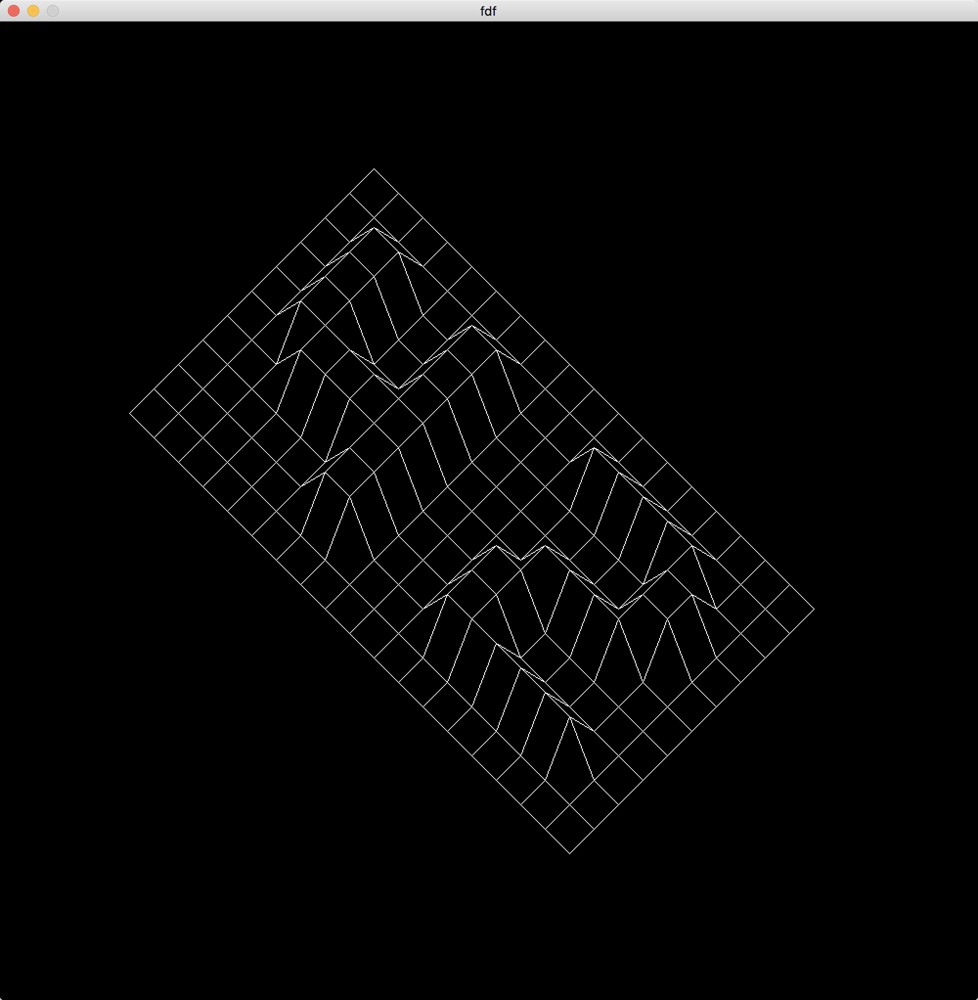

Project of Le 101 School.

The point of this project was to make a simple wireframe renderer that complies with the norm imposed by the school. We also couldn't use many external functions and libraries, making us re-code almost everything.
Only works on Mac OS (for now).

TODO: Adapt to all platforms, add more (and better) projections, make the wireframe movable and rotatable, hide the edges that are behind faces, add color.

# Screenshots

